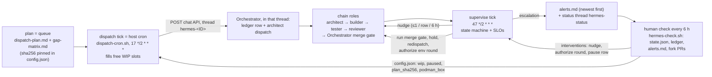

# Hermes port autopilot: WIP-limited dispatch, chain supervision, bounded nudges, human check

This is the system doc and the spec the builders implement. It turns the manual loop in
`dispatch-plan.md` ("operator POSTs a dispatch, the chain runs, the Orchestrator merges") into
one host cron on the box (the dispatch tick), one recurring Orchestrator task (the supervise
tick) and one Mac-side check script, with every decision that needs a human landing in one file
the human reads every 6 hours.

Inputs it reads (never edits): `dispatch-plan.md`, `gap-matrix.md`, the ledger
`groups/orchestrator/reports/ledger.md` (= `/workspace/agent/reports/ledger.md`), the role
sessions on each row's thread, and the fork `slang-coworkers/hermes-agent`. Outputs it owns:
`data/shared/hermes/autopilot/state.json` (container: `/workspace/shared/hermes/autopilot/state.json`),
`groups/orchestrator/reports/status/alerts.md`, the nudges and one-line notes it sends, and the
dispatches it makes. The ledger stays the
Orchestrator's (the merge gate in `container/spines/hermes/context/merge-gate.md` edits it); the
autopilot only reads it and, on the dispatch tick, adds the row through the Orchestrator exactly
as a hand dispatch would.

Code layout (everything under `ops/nemoclaw-coworkers/autopilot/` unless noted; `deploy.sh` and
`install.sh` mirror it to `data/shared/hermes/autopilot/`, which the Orchestrator container mounts
at `/workspace/shared/hermes/autopilot/` and the host cron runs from):

| Path | What |
|---|---|
| `hermes_queue.py` | the dispatch core (stdlib, py3.11, `--now` for tests): plan + matrix + ledger + config + prior state → `wip`, `in_flight`, `eligible_next` with the §4.4 text per row (`dispatch_text` for the architect, `orchestrator_text` = the same wrapped in the ledger-row + forward steps the cron POSTs), `gating`, `alerts` |
| `hermes_supervise.py` | the supervise core: that state + the row threads + the fork PRs + the nudge book → stage per row, SLO check, bounded `hold` / `gate` / `nudge` / `alert` actions (§2, §3, §5) |
| `collect_threads.py` | inside the container: the role sessions on each `hermes-<ID>` thread via `ncl sessions list/messages` + `ncl cost-cap status`, bounded by `--rows` (the in-flight rows) and `--deadline-s` |
| `pull-state.sh` | inside the container: the `gh` and `ncl` probes, then queue → collector → supervisor; writes `state.json`, `threads.json`, `prs.json` (tmp + rename). A failed probe is a `collector_errors` entry, never a silent gap |
| `record.py` | the bookkeeping after each send (`nudged`, `alerted`, `dispatched`, `redispatched`, `round3`), atomic; the Orchestrator calls it from the supervise tick, the cron from the dispatch tick; `alerted` also inserts the line newest-first into `alerts.md` |
| `dispatch-cron.sh` | on the HOST, from the box's crontab (`17 */2 * * *`), hostname-guarded: runs the queue on host paths, raises its alerts, POSTs each eligible row's `orchestrator_text` to the dashboard chat API on `thread_id = hermes-<ID>` (the shape of `dispatch-rows.sh`), records every HTTP 200 with `record.py dispatched`; `--dry-run` prints the bodies and writes nothing (§6) |
| `gate-supervise.sh` | the `ncl tasks --script` gate of the supervise series: runs `pull-state.sh` under `timeout 22` (10 s transcript budget), prints `{"wakeAgent": <bool>, "data": {...}}` last |
| `supervise-tick.md` | the supervise task prompt (§6), passed verbatim to `ncl tasks create --prompt` |
| `scorecard.py` | renders the human's scorecard from the pulled files (§7); `--markdown [PATH]` / `--brief [PATH]` render the a \| b \| t \| r report through `abtr.py` |
| `abtr.py` | the a \| b \| t \| r report: one markdown line per row with architect, builder, tester, reviewer and the gate as cells; `pull-state.sh` writes it every tick to `reports/status/autopilot.md` (viewer `/status/autopilot.md`) and its brief to `tick-report.txt`, the supervise tick's run output (§7) |
| `install.sh` | box-side, hostname-guarded: mirrors the directory, creates or updates the supervise series (idempotent by name slug), installs the one dispatch crontab line (replacing any earlier one), cancels a leftover `hermes-ap-dispatch` series |
| `config.json` | the human's knobs (§6); the live copy on the box is never overwritten by a deploy |
| `test_*.py` | unittest: every rule in §2 to §8 that names a regex or a threshold has a test; `test_pull_state.py` runs `pull-state.sh` and the supervise gate offline against a fake `ncl` and `gh`; `test_dispatch_cron.py` runs `dispatch-cron.sh` against a fake `hostname`, `curl` and `ncl` |
| `ops/nemoclaw-coworkers/hermes-check.sh` | Mac-side, refuses to run on a box: the 6-hourly human check (pull, scorecard, paste-ready interventions) |

Fixtures for the tests: `fixtures/ledger.md` (the box's ledger: P0-LOOP merged, LOOP-F35 at spec
handoff) plus the git copies of `dispatch-plan.md` and `gap-matrix.md`.

## 1. Purpose and the control loop

The port has 30 dispatchable rows, a four-role chain per row, round caps, a merge gate and a
$150 ceiling per coworker session. Run by hand it stalls on whoever is asleep. The autopilot
keeps up to `wip` rows moving, notices a stalled stage by its SLO, nudges the role that owes the
next artifact at most once per 6 hours per row, and escalates only what the plan says a human
decides. A tick with nothing to do writes `state.json` and posts nothing.



The dispatch tick is a host cron on the box (`dispatch-cron.sh`, one crontab line next to the
other `~/.config/nanoclaw/refresh-*.sh` crons). It POSTs each dispatch to the dashboard chat API
on `thread_id = hermes-<ID>`, as a hand dispatch does, so the Orchestrator handles it in the row's
own dashboard thread and every reply in the chain homes there (§6, §9). The supervise tick is an
`ncl tasks` series on the Orchestrator group (`ag-822c9c8a-23e2-4e7a-a6bc-4c071d976392`) with a
`--script` gate that runs the deterministic core inside the Orchestrator's container and wakes the
agent only when there is an action to take. The human never talks to the ticks directly: the
knobs live in `data/shared/hermes/autopilot/config.json` (`/workspace/shared/hermes/autopilot/config.json`
in the container; both ticks read it on every fire), and the Mac-side check script prints the
intervention commands the human pastes into a shell on the box (§7).

## 2. Row state machine

One state per gap-matrix row, derived on every supervise tick from three sources in fixed
priority. Nothing is remembered from the previous tick except bookkeeping (nudge times,
alert times, redispatch counts, round-3 authorizations); the state itself is recomputed.

### 2.1 States

| State | Meaning | Clock starts at |
|---|---|---|
| `queued` | in the plan as BUILD / CONFIGURE / ADOPT, no ledger row, no dispatch on its thread | eligibility (see §4) |
| `dispatched` | ledger row exists, architect dispatched, no `[Spec handoff]` yet | ledger `dispatched` cell |
| `spec_handoff` | architect's `[Spec handoff] <ID>` seen, builder has no inbound hand-off on the thread yet | the handoff message |
| `building` | builder holds the row and there is no PR yet, or a `FAIL` / `REQUEST_CHANGES` demands a new head and none has appeared | builder's first inbound, or the FAIL / RC verdict |
| `pr_open` | a fork PR titled `[<ID>]` exists, no tester hand-off for its head yet | PR `createdAt`, or the new head's push |
| `testing(k)` | tester received the round-`k` hand-off for head H, no `[Test Report]` for H yet | the hand-off inbound in the tester's session |
| `review` | latest `[Test Report]` for the current head is `PASS`, no `[Review Verdict]` for that head | the PASS report |
| `gate` | `[Review Verdict] APPROVE` for the current head; waiting for `[Triage Resolution]` + the Orchestrator's merge gate | the APPROVE verdict |
| `merged` | terminal: ledger outcome says merged, or the fork PR is `MERGED` | |
| `blocked` | terminal for the autopilot: the Orchestrator stopped the row (`blocked: STOP …`, or caps exhausted), or the PR was closed unmerged; a human decides | |
| `deferred` | plan disposition DEFER; never dispatched | |
| `carried` | plan disposition MERGE→<target>; never dispatched; satisfied when the target merges | |

Two flags ride on any non-terminal state and pause its SLO clock: `hold` (merge held by a
plan gate, §4.3) and `cost_hold` (a role session on the row is `escalated` or `stopped` on its
cost cap; a human card is pending). A third flag, `gate_red: P<n>`, marks a gate rejection
with rounds remaining; the row is then `building` or `testing` again per the fix the gate asked for.

Transitions: `queued → dispatched → spec_handoff → building → pr_open → testing(1) → {review | building}`,
`review → {gate | building}`, `building → pr_open` (new head) `→ testing(k+1)`, `gate → {merged | building | blocked}`.
A `FAIL` at round 2, a `REQUEST_CHANGES` at review round 2, or a second gate pass on the same head
exhausts a cap; the Orchestrator then writes `blocked: STOP …` (§5) and the row is `blocked`.

### 2.2 Detection, in priority order

**Source A: the ledger** (`/workspace/agent/reports/ledger.md`). Table with header
`row-id | dispatched | spec accepted | PR | verdict | merged/blocked | notes`; locate columns from
the header row, never by position. Row ids are matched whole-cell with
`^[A-Z0-9]+-F[0-9]+(\.[a-z])?$` so `OPS-F58.a` and `SELF-F57.b` are their own rows and
`OPS-F58` does not swallow them. A cell that fails the whole-cell match but names exactly one id
token (`LOOP-F35 (1a)`, `[LOOP-F35]`, `LOOP-F35` followed by a note, a U+2011 hyphen) is read as
that id: the row keeps its WIP slot, is never re-dispatched, and raises `ledger-id-spelling` with
the raw cell (`ledger.id_cell_raw`). Dropping it to `other_rows` would free the slot and put the
row back in `eligible_next`. Two ids in one cell stay a non-matrix row, alerted. Rows naming no
id (`P0-LOOP`, `P1-HELLO`, `P2-PREFLIGHT`, `P2-E2E-BASELINE`) are ignored for state but counted
in `sources.ledger.other_rows`. Two rows for one id is a ledger bug: use the last, raise the
`ledger-duplicate` alert.

| Cell | Signal | Rule |
|---|---|---|
| `dispatched` | dispatched | non-empty and not a lone dash (any width; the ledger writes U+2014), `-` or `n/a`; the first `YYYY-MM-DD HH:MM` in the cell is `dispatched_at` (install TZ unless a zone is named) |
| `spec accepted` | spec handoff | same emptiness rule; timestamp likewise |
| `PR` | pr number | first `#(\d+)`; the fork slug is implied |
| `verdict` | rounds (cross-check only) | `round (\d)/2` and `PASS\|FAIL\|APPROVE\|REQUEST_CHANGES`; the tester's and reviewer's own messages (source B) are authoritative |
| `merged/blocked` | outcome | scan for the tokens `merged` (case-insensitive, must be followed within 60 chars by a 7 to 40 hex sha or a `/pull/N` url) and `blocked:` (the reason follows after a dash of any width); the **last** token in text order wins. `blocked: STOP` is terminal. `blocked: P<n>` without `STOP` is `gate_red`, not terminal, unless caps are exhausted by count |

The fixture's P0-LOOP cell reads `**ROUND 3/3 … ✅ MERGED \`0f12e89\` (squash) into … /pull/1**`:
a `^merged` anchor misses it, which is why the token scan is anywhere-in-cell. LOOP-F35's PR,
verdict and outcome cells are all the lone dash, and `spec accepted` is a timestamp: `spec_handoff` or later.

**Source B: role sessions on the thread.** The Orchestrator has `cli_scope=global`, so for each
in-flight row and each role in `hermes-architect`, `hermes-builder`, `hermes-tester`,
`hermes-reviewer`, plus the Orchestrator itself:

```bash
ncl sessions list --agent-group-id <role-group-id> --thread-id hermes-<ID> --json
# thread_id is populated only in per-thread session mode; empty → list the group's sessions
# and keep those whose messages mention "hermes-<ID>", "[<ID>]" or "<ID>:" in a marker line
ncl sessions messages <sid> --json --limit 200
```

Each message row carries `direction` (`in`/`out`), `sender`, `text`, ISO timestamp. Markers, all
matched on the first line of `text`; `<slug>` is `slang-coworkers/hermes-agent`:

| Role, direction | First-line pattern | Sets |
|---|---|---|
| architect `out` | `^\[Spec handoff\] <ID>:` | `spec_handoff_at`; `core_change` = the `**CORE-CHANGE:**` bullet is not `none` |
| architect `out` | `^\[Blocker\]` | `blocker_open` (supervisor flag; the Orchestrator owns the answer) |
| architect `out` | `^\[Triage Resolution\] <ID>:` with `**Outcome:** fixed` and a `## Merge gate` line | `gate_requested_at` |
| architect `out` | same with another Outcome | `blocked` candidate; ledger decides |
| builder `in` | first line starts `Spec handoff <ID>` (unmarked forward) | `builder_started_at` |
| builder `out` | unmarked hand-off to the tester, or `^\[Fix Report\]` reply to a FAIL; extract `#(\d+)` and `head ([0-9a-f]{7,40})` | `handoff[k]` |
| tester `in` | the builder's hand-off above, as seen from the tester side | authoritative `testing(k)` start |
| tester `out` | `^\[Test Report\] <slug>#(\d+) \(round (\d)/2, head ([0-9a-f]{7})\)` then `**Verdict:** PASS`, `**Verdict:** FAIL`, or a Verdict line containing `ESCALATE` (the round-2 `FAIL ×2` form included) | `test_rounds[]`; `ESCALATE` rounds are not counted toward the cap (hermes-verify) and set `env_fail` |
| reviewer `out` | `^\[Review Verdict\] <slug>#(\d+) \(round (\d), head ([0-9a-f]{7})\)` then `**Verdict:** APPROVE` or `**Verdict:** REQUEST_CHANGES` | `review_rounds[]` |
| Orchestrator `out` | `^Merged <slug>#(\d+)` | merged confirmation |
| Orchestrator `out` | `^blocked: P\d` or `^blocked: STOP` | gate red / stop |
| Orchestrator `out` | `^Supervisor nudge <ID>:` | a nudge was sent (reconciliation, §8) |

Report and verdict messages name the PR number, not the row id; the fork (source C) maps
`#N → ID`. Three reading rules, each pinned by a test: every role's session on the thread is
read, so one send appears twice (the sender's `out`, the receiver's `in`), and the supervisor
keeps one event per (kind, PR, round, head, verdict, first line) within 15 minutes; once the row's
PR is known, a report, verdict or hand-off addressed to another PR is another row's traffic and
is ignored; a thread with any session whose transcript could not be read (ncl failure, deadline,
not in flight) is unreadable, and an unreadable row draws no action this tick (§8). Session liveness for each role comes from the same `sessions list` rows:
`container_status` and `last_active`, plus `ncl cost-cap status --session <sid>` for
`cost_status` (`ok|warn|escalated|stopped|unknown`; absent or `unknown` is no signal).

**Source C: the fork.** One call per tick:

```bash
gh pr list --repo slang-coworkers/hermes-agent --state all --limit 100 \
  --json number,title,headRefName,baseRefName,isDraft,state,createdAt,updatedAt,mergedAt,closedAt,headRefOid,comments
```

A PR belongs to row `<ID>` when its title contains `[<ID>]` (the hermes-implement title
convention `<type>(<scope>): <description> [<req-id>]`), else when `headRefName` equals
`plugin/<id-lowercase>`. `state == MERGED` is authoritative for `merged`; `CLOSED` unmerged is
`blocked` with reason `pr-closed`; `OPEN` gives the current head (`headRefOid`), which decides
whether the latest test report is for the current head. `comments` whose body starts
`[Test Report]` are the builder's mirrors, one per head: a cross-check on the round count. If
`gh` fails twice in a row the tick degrades (`sources.fork.checked=false`): PR state comes from
the ledger and the builder's messages, no `merged` is asserted from the fork, and the
`fork-unreachable` alert fires after two consecutive failed ticks.

### 2.3 Resolution

Terminal states first: fork `MERGED` or ledger `merged` → `merged` (disagreement → the
`ledger-drift` alert, state `merged`); ledger `blocked: STOP`, or caps exhausted by count, or
PR `CLOSED` unmerged → `blocked`. Otherwise walk the chain backwards and take the first state
whose evidence exists: `gate` (APPROVE for current head) → `review` (PASS for current head) →
`testing(k)` (hand-off for current head without a report) → `pr_open` (PR exists, current head
unhanded) → `building` (FAIL / RC on an older head, or builder started and no PR) →
`spec_handoff` → `dispatched` → `queued`. Plan dispositions decide `deferred` and `carried`
before anything else; a DEFER or MERGE→ id that shows up in the ledger as dispatched is the
`plan-violation` alert.

## 3. SLOs, nudges, escalation

Hours are wall-clock from the state's clock (§2.1), with `hold` and `cost_hold` time excluded.
A nudge goes to the role that owes the next artifact; escalation writes `alerts.md` and posts
on the status thread. **At most one nudge per row per 6 hours**, across states: a state change
does not reset that bound. Escalation requires at least one nudge already sent for the row in
this state, except `blocked` and `cost_hold`, which escalate immediately and never nudge.

| State | Nudge after (h) | Nudged | Escalate after (h) |
|---|---|---|---|
| `queued` (eligible, WIP slot free, still undispatched) | 4 | nobody: this is a dispatch-tick fault | 6 |
| `dispatched` | 6 | hermes-architect | 12 |
| `spec_handoff` | 2 | hermes-architect | 6 |
| `building` | 8 | hermes-builder | 16 |
| `pr_open` | 2 | hermes-builder | 6 |
| `testing(k)` | 6 | hermes-tester | 12 |
| `review` | 4 | hermes-reviewer | 10 |
| `gate`, no `[Triage Resolution]` yet | 4 | hermes-architect | 8 |
| `gate`, `[Triage Resolution]` present | 4 | the Orchestrator itself (the tick runs the merge gate; §6) | 8 |
| `blocked` | never | nobody | 0 (once) |
| `cost_hold` on any state | never | nobody | 0 (once per episode) |
| `merged`, `deferred`, `carried` | never | | never |

Nudges are `send_message(to="<role>", thread_id="hermes-<ID>", text=…)`, with
`in_reply_to=<the role's last inbound id on this thread>` when one exists. The text is unmarked
(first character is not `[`): the always-on chain-routing gate denies a marker-prefixed fresh
send. One template, filled per state; every line names the row and the artifact expected:

```
Supervisor nudge <ID>: <state> for <h>h, no <artifact>. Expected next: <artifact> on thread hermes-<ID>. Reply on this thread: status, blocker, ETA. If your container restarted, re-read your task memory and resume.
```

| State | `<artifact>` and `Expected next` |
|---|---|
| `dispatched` | `[Spec handoff]` with the ADR and acceptance test attached, or a `[Blocker]` naming what stops you |
| `spec_handoff` | the unmarked forward to hermes-builder with memo, ADR and acceptance test |
| `building` (no PR) | a draft PR on slang-coworkers/hermes-agent, base release/<tag>-e2e-fixed, titled `[<ID>]`, then the round-1 hand-off to hermes-tester |
| `building` (after FAIL / RC round k) | a new head on PR #N fixing the named rows, re-entering hermes-tester as round k+1/2 |
| `pr_open` | the round-k hand-off to hermes-tester for PR #N head <sha7>, with `## Scenarios` and the ADR attached |
| `testing(k)` | `[Test Report] PASS or FAIL` for PR #N head <sha7>, with test-report-<sha7>.md attached |
| `review` | `[Review Verdict]` round j/2 for PR #N head <sha7> on the builder's edge |
| `gate` (architect) | `[Triage Resolution] <ID>` with `Outcome: fixed` and the `## Merge gate` block relaying the builder's `[Fix Report]` |

Escalation entry, one line, inserted directly under the header of
`/workspace/agent/reports/status/alerts.md` (host: `groups/orchestrator/reports/status/alerts.md`).
Newest first; existing lines are never edited or removed:

```
- <ISO UTC> · <ID> · <state> <h>h · <what is wrong, with the values> · nudged <n>× (last <ISO>) · decision: <the choice the human has> · PR #N · thread hermes-<ID>
```

The same line goes to the status thread: `send_message(to="<the human's channel destination>", thread_id="hermes-status", text="Autopilot alert <ID>: …")`,
destination resolved with `ncl destinations list --json` (the `channel` row, as
`hermes-status-report` §1.0 does). One alert per `(row, state)` per 24 hours; a state change
re-arms it. Alert reasons that are not row states: `cost-card`, `core-change`, `plan-changed`,
`blocked-twice`, `ledger-drift`, `ledger-duplicate`, `ledger-id-spelling`, `ledger-unknown-id`,
`ledger-unreadable`, `plan-violation`, `fork-unreachable`, `sessions-unreachable`, `tick-stale`,
`nudge-unconfirmed`, `hold-too-long`, `podman-box-needed`.

## 4. Queue, WIP and gating rules (from `dispatch-plan.md`)

`hermes_queue.py` parses the plan file, not a hand-kept list, so the plan stays the single
source. The parse is structural: `## Batch 1a`, `## Batch 1b` (its `**Wave n**` paragraphs),
`## Batch 2`, `## Batch 3`, `## Batch 4`, `## Adopt` (its `**Attaches to <phase>**`
paragraphs), `## Defer`; a row is the first table cell in those sections matching the id regex,
with `**` stripped. `gap-matrix.md` supplies `disposition` and `esc`. The parse must reproduce
the plan's coverage check (30 dispatched = 1 + 18 + 6 + 4 + 1, 16 adopt, 11 merge, 4 defer = 61)
or the tick refuses to dispatch and raises `plan-changed`.

### 4.1 WIP

`in_flight` = rows in `dispatched`, `spec_handoff`, `building`, `pr_open`, `testing`, `review`,
`gate` (held rows included, they hold containers; `blocked` and `cost_hold` rows are not
counted). The dispatch tick dispatches `max(0, wip - in_flight)` rows, never more, where `wip`
comes from `config.json` (default 3, plan rule 4). `in_flight` is computed from the ledger and
the threads, not from the previous `state.json`, so a hand dispatch between ticks is seen.

### 4.2 Eligibility and order

Batch 0 (`P0-LOOP`) is history and never re-dispatched. Rows are eligible in this order, and the
first eligible undispatched rows fill the free slots:

1. **Batch 1a**: `LOOP-F35` alone. Eligible immediately. Blocks everything else.
2. **Batch 1b and batch 2, and the adopt rows that attach to P2 and P3-waveA**: eligible once
   1a's PR has a tester `PASS` at its current head (`gates.1a_first_pass`). Order: 1b wave 1
   (`MEM-F44`, `OPS-F58.a`, `OBS-F46`: retention first), then 1b waves 2 to 5 in table order,
   then batch 2 in table order (`LOOP-F37`, `GOV-F24`, `GOV-F25`, `COST-F29`, `COST-F30`,
   `LOOP-F40`), then the P2 adopt rows, then the P3-waveA adopt rows. **BUILD lane:** when a BUILD
   row is eligible and no BUILD row is in flight, it is dispatched before the next CONFIGURE row
   regardless of queue position, so the 18 cheap config rows cannot starve `LOOP-F37`.
3. **Batch 3** (`CRED-F28`, `ISO-F13`, `ISO-F14`, `ISO-F15`) and **batch 4** (`A2A-F21`) plus the
   P5 adopt rows: eligible once every batch 2 row is `merged` (or listed in `config.waive`).
   Batch 3 additionally needs `config.podman_box == true`; while false, the rows sit in `queued`
   without SLO clocks and the `podman-box-needed` alert fires once when they become otherwise eligible.
4. **P6 adopt row** (`ISO-F17`): eligible once batches 3 and 4 are merged. Batch 5 has no rows.
5. **DEFER rows** (`CH-F53`, `SELF-F57.a`, `RT-F04`, `RT-F06`) are never dispatched.
   **MERGE→ rows** (11) are never dispatched; their `AC-<id>` criteria ride the target's ADR.

### 4.3 Merge holds

No 1b, batch 2 or adopt row may merge before `LOOP-F35` merges. A row reaching `gate` while
`gates.1a_merged` is false gets `hold: 1a`; the supervise tick tells the Orchestrator to hold
the gate (no `gh pr ready`, no merge), the row's SLO clock pauses, and `hold-too-long` fires if
the hold exceeds 48 hours. If `LOOP-F35` becomes `blocked`, every held row alerts under
`blocked-twice` semantics for the human (the port cannot proceed). Batch 3 and 4 rows hold the
same way on `gates.batch2_merged`.

### 4.4 Dispatch texts

The dispatch cron POSTs `{group: "orchestrator", thread_id: "hermes-<ID>", content:
orchestrator_text}` to the dashboard chat API. `orchestrator_text` tells the Orchestrator, in
order: re-check the ledger for the id; add the ledger row (`row-id = <ID>`, `dispatched = <local
stamp> (to hermes-architect, thread \`hermes-<ID>\`)`, other cells the lone dash, notes
`autopilot dispatch, batch <b>, <disposition>; <name>; carries <AC list or none>`); send the
architect the text under the dashed line verbatim as an unmarked fresh message on
`thread_id="hermes-<ID>"`; reply on the thread only with the outcome line. Because the POST
itself lands on `hermes-<ID>`, the row has its dashboard thread by construction; no separate
"Dispatched <ID>" line is sent (the queue still emits `dashboard_line`, unused).

Build / configure template (the fields of `dispatch-rows.sh` and the plan's v3 message):

```
Dispatch <ID>: <name>.

Requirement row: /workspace/shared/hermes/gap-matrix.md (row <ID>; disposition <BUILD|CONFIGURE>); evidence: /workspace/shared/hermes/gap-matrix-evidence.md (section <ID>); baseline: topology.md; plan: /workspace/shared/hermes/dispatch-plan.md (batch <b>). Cite the pinned release tree; author plugin code against the MAIN module paths named in the evidence.
The ADR must cover this row AND every id it carries: <AC-<id> list from the plan's "carries" bullets, or "none">.

Deliver the ADR + acceptance test (kinds pytest: / ui: / desktop: / live:) as the gated [Spec handoff] on this thread, then forward to hermes-builder. Draft PR on slang-coworkers/hermes-agent, base release/<tag>-e2e-fixed, title suffix [<ID>]. Round caps 2 test / 2 review.
```

Appended when the row carries an upstream ask (`esc = Y` in the matrix, or the row is named in
the `Owner row` column of the plan's P8 table; the parser reads that table, never a hand list):

```
Upstream ask: this row is plugin-only. Anything the plugin surface cannot do goes in the ADR's ## CORE-CHANGE section with the release-tree citation; the Orchestrator files it as an upstream ask (plan decision 2). No fork patch outside plugins/** without that citation.
```

Adopt template (doc page plus one hermetic acceptance test, lighter ADR, one reviewer pass):

```
Adopt <ID>: <name>.

Adopt-track row (dispatch-plan.md § Adopt, attaches to <phase>): Hermes already provides this. Deliverable: ONE doc page under website/docs/ mapping the NanoClaw behaviour onto the Hermes feature, citing the Hermes file (path + function or config key) in the tag:/main: form of gap-matrix-evidence.md § <ID>, plus ONE hermetic acceptance test proving Hermes does it. No plugin. ADR is the doc page's outline plus a ## Acceptance criteria table with pytest: rows only. Same chain, same draft PR shape (title suffix [<ID>]), same merge gate.
```

An adopt row that also owns a P8 ask (`COST-F31`, `CH-F50`, or `esc = Y`) gets a shorter clause
instead: record what Hermes lacks in the ADR's `## CORE-CHANGE` section with the citation, the
Orchestrator files it; still no plugin, no fork patch outside `website/docs/**` and `tests/**`.

Adopt rows run on their own `hermes-<ID>` thread, not a shared `hermes-adopt-<phase>` thread:
one thread per row is what makes §2 deterministic (§9, question 2; the plan says the same).

## 5. Delegated authority

The Orchestrator decides alone (the supervise tick emits the action; the Orchestrator executes
and records it in the ledger's `notes` cell and in `state.json`):

| Decision | Trigger | Bound |
|---|---|---|
| one extra test round | the tester's latest report for the row is `ESCALATE` or its FAIL is marked environmental: `install_packages`, `desktop tier unavailable`, `pre-existing` / `cited-pre-existing` base failures, or infra (`mergeable UNKNOWN` after retries) | one per review cycle per row (`authorize_round["<ID>"]`, cleared when the cycle ends); ledger note `extra round authorized by autopilot §5: <why the next run will differ>`; the cost ceilings are the hard stop |
| file an upstream ask | `[Spec handoff]` with `CORE-CHANGE` not `none`, or an ADR `## CORE-CHANGE` section | append to `/workspace/agent/reports/upstream-asks.md` (row, citation, the ask verbatim), one line on the row thread; posting to the upstream repo is the human's |
| re-dispatch after a bounced container | a role holds the row's next step, its session is `stopped` or absent, it produced zero outbound since the hand-off, and the hand-off is 1 h old | max 2 per row per stage, same thread, same text, note `redispatch n/2`; a third need escalates |
| stop a row at its round cap | two in-plugin test FAILs in the current review cycle (`FAIL (env)` and `ESCALATE` never count) with no authorization left, review REQUEST_CHANGES ×2, or a second gate red on the same head | decide first (delegated-decisions.md: extra round with a named reason / re-spec / stop), then ledger `merged/blocked = blocked: STOP cap - <what>`; one alert; nothing re-dispatches it |
| action the tester's `install_packages` request | the report's `DESKTOP` row reads `SKIPPED` with an `install_packages: <pkgs>` request | the request is filed (self-mod approval is a human card by construction); ledger note |
| run the merge gate, merge, hold | `[Triage Resolution] Outcome: fixed` with `## Merge gate`; holds per §4.3 | already the Orchestrator's; unchanged |
| nudge | §3 | §3 bounds |

Escalates to the human (alert + status thread; the row waits):

| Decision | Trigger | What unblocks it |
|---|---|---|
| cost ceiling card | any role session on the row is `escalated` or `stopped` (`ncl cost-cap status`) | the dashboard Continue / Stop card (plan decision 3: the human approves each card through 1a and 1b) |
| core change to the fork outside plugin-first | ADR `## CORE-CHANGE` names a path outside `plugins/**`, `website/docs/**`, `tests/**`, `apps/desktop/e2e/*-ac<n>.spec.ts` | the human adds the id to `config.core_change_ok`; until then the row may build but the gate holds (`hold: core-change`) |
| changing the plan or the matrix | `sha256(dispatch-plan.md)` or `sha256(gap-matrix.md)` differs from `config.plan_sha256` / `config.matrix_sha256` | the human re-pins the hashes in `config.json`; dispatch is paused meanwhile, supervision continues |
| a row blocked twice | a row that was `blocked` and then re-dispatched by hand blocks again, or a held chain's 1a dependency blocks | the human's call in the row thread; the autopilot never dispatches that id again |
| a policy change | WIP, SLO hours, round caps, batch order, nudge cadence | edit `config.json` (WIP, paused, podman_box, waive) or this document |
| baseline branch missing on the fork, `gh` or `ncl` down for two ticks | the merge gate's P6 condition; `sources.*.checked=false` twice | operator task |

## 6. The two ticks: a host cron and one recurring task

**The dispatch tick is a host cron, not a task series.** An `ncl tasks` series runs in its own
isolated session (`system:tasks:<seriesId>`), and an a2a dispatch sent from that session homes
the architect's replies, the `[Spec handoff]`, the test reports and the review verdicts in the
task's system session, not in the per-row dashboard thread `hermes-<ID>` where the operator and
the status page read the chain. So `dispatch-cron.sh` runs from the box's crontab, on the host,
and POSTs each dispatch to the dashboard chat API on `thread_id = hermes-<ID>`, exactly the shape
of `ops/nemoclaw-coworkers/dispatch-rows.sh`; the Orchestrator handles that inbound in the row's
thread (ledger row, architect dispatch), and everything the chain sends back lands there too.

**The supervise tick stays an `ncl tasks` series** on the Orchestrator group, because it needs
the Orchestrator's own session (its `[Triage Resolution]` inbox for the merge gate, `send_message`
for nudges) and reads the role threads through `ncl` from inside the container. Cron is wall-clock
in the group's timezone. Twelve fires a day exceeds the ungated limit (`MAX_DAILY_FIRES = 4`),
which is why it carries a `--script` gate: a gated fire that finds nothing costs zero tokens, and
that is the idempotency rule made mechanical. The host cron needs no gate; a quiet fire costs a
few seconds of Python.

Both are installed (and later refreshed) on the box by `ops/nemoclaw-coworkers/autopilot/install.sh`
(hostname guard; finds the supervise series by its name slug `hermes-ap-supervise-<hex>` in
`./bin/ncl tasks list --json` and updates it in place, so running it twice never yields two series;
replaces any crontab line mentioning `dispatch-cron.sh`, so running it twice never yields two
lines; cancels a `hermes-ap-dispatch` series left from the earlier design):

```bash
cd ~/haaggarwal/nemoclaw-coworkers
bash ops/nemoclaw-coworkers/autopilot/install.sh   # mirror + hermes-ap-supervise (47 */2 * * *) + the crontab line below
crontab -l | grep dispatch-cron
# 17 */2 * * * /home/ubuntu/haaggarwal/nemoclaw-coworkers/data/shared/hermes/autopilot/dispatch-cron.sh >> /home/ubuntu/haaggarwal/nemoclaw-coworkers/data/shared/hermes/autopilot/dispatch-cron.log 2>&1
```

**`dispatch-cron.sh`** (host; `ROOT` defaults to `~/haaggarwal/nemoclaw-coworkers`): reads the
plan and the matrix from `data/shared/hermes/`, the ledger from
`groups/orchestrator/reports/ledger.md`, `config.json`, `nudges.json` and the last `state.json`
from `data/shared/hermes/autopilot/`. It builds the queue's prior state the way `pull-state.sh`
does (the previous `state.json` rows and signals, plus `dispatched` entries from `nudges.json`
and, when `./bin/ncl` answers, any architect or orchestrator session already on a `hermes-<ID>`
thread), runs `hermes_queue.py`, then:

1. raises every queue alert that `nudges.json` does not show as raised for the same (row, kind)
   in 24 h, through `record.py alerted` (the §3 line format; the decision text per kind is in the
   script). This is the one output a paused or quiet tick may still produce; alerts go to
   `alerts.md` only, there is no status-thread line from the host;
2. stops with exit 0 when `dispatch_paused` is set (`config.paused`, `plan-changed`, ledger
   unreadable) or `eligible_next` is empty or `wip.free` is 0, with one line saying which;
3. otherwise, for at most `wip.free` rows in `eligible_next` order: re-checks the ledger for the
   id as a whole token (a hand dispatch since the queue ran skips the row), POSTs
   `{group, thread_id, content: orchestrator_text}` with `curl -m 15`, and on HTTP 200 runs
   `record.py dispatched --row <ID> --batch <b>` and appends one line to `dispatch.log`. Any other
   status, or an unreachable API, stops the tick with exit 1 and records nothing for that row: the
   row is simply eligible again next fire. It never edits the ledger, the plan, the matrix or
   `state.json`; its own queue output goes to `dispatch-state.json`.

`dispatch-cron.sh --dry-run` prints the bodies it would POST and writes nothing.

**Gate script** (`gate-supervise.sh`) runs inside the Orchestrator container under bash, 30 s,
1 MB, last stdout line JSON. It runs `pull-state.sh` under `timeout 22` with
`COLLECT_DEADLINE_S=10` for the transcript reads (each `ncl` call is a session-DB round trip, so
the collector stops reading at the budget and lists the rest unread), then reads `state.json` and
prints `{"wakeAgent": <any action other than hold, or partial>, "data": {...}}`. `partial` is a
pull killed by the timeout; the prompt then reruns `pull-state.sh` in its turn. `pull-state.sh`
writes `state.json` atomically (tmp + rename) every fire, so a quiet tick still leaves a fresh
`generated_at` for the human check (the dispatch cron reads that `state.json` as its prior state).

**Supervise prompt responsibilities** (`supervise-tick.md`): execute exactly `actions`, in this
order: `hold` (ledger note only), `gate` (run `merge-gate.md` for the named PR), `nudge` (§3
template, verbatim), `alert` (alerts.md line + status thread). After each send call
`record.py nudged --row <ID> --role <role> --state <stage> --text <text>` (or
`alerted --reason <alert_key> --line <text>`). The status thread carries alerts only, never a
tick summary. Sent nudges plus bound skips must equal `summary.must_nudge`; a mismatch is a
`[SUPERVISOR INVARIANT VIOLATION]` line in the run output. Re-dispatch after a bounced container
and the authorized third round (§5) are decided by the same evidence but executed by hand today:
the supervisor reports `env_fail` and the `env-fail` alert; the human sets `authorize_round`.

**Pause, resume, change WIP.**

```bash
CFG=data/shared/hermes/autopilot/config.json
jq '.paused = true' $CFG > $CFG.tmp && mv $CFG.tmp $CFG   # stop dispatching (the cron reads it every fire); supervision keeps running
jq '.paused = false' $CFG > $CFG.tmp && mv $CFG.tmp $CFG  # resume
crontab -l | grep dispatch-cron                          # the dispatch tick; remove the line to stop the cron itself
./bin/ncl tasks list --group <orchestrator-group-id>     # the supervise series and its next fire
./bin/ncl tasks pause --id <supervise-series-id> --group <orchestrator-group-id>    # stop nudging and escalating too
./bin/ncl tasks resume --id <supervise-series-id> --group <orchestrator-group-id>
```

`data/shared/hermes/autopilot/config.json` (container: `/workspace/shared/hermes/autopilot/config.json`),
re-read on every fire; missing keys take the defaults shown:

```json
{
  "wip": 3,
  "paused": false,
  "paused_rows": [],
  "plan_sha256": "<sha256 of dispatch-plan.md the human approved>",
  "matrix_sha256": "<sha256 of gap-matrix.md>",
  "podman_box": false,
  "waive": [],
  "core_change_ok": [],
  "authorize_round": {}
}
```

`paused: true` stops dispatch (supervision continues) without touching the crontab or the series;
`paused_rows` removes those rows from nudging and escalation and holds their gate;
`authorize_round` is `{"<ID>": "<reason>"}` and lifts that row's test cap by exactly one round
in the current review cycle (a third counted FAIL in that cycle still blocks); a new review cycle
starts with the base budget, so re-authorize per cycle when needed. Changing `wip` takes effect on the next dispatch tick; lowering it
never kills anything, it only stops filling slots.

## 7. The human's 6-hourly check

`ops/nemoclaw-coworkers/hermes-check.sh [LOCAL_DIR]` runs on the Mac (it exits 1 on any
`slang-cpu-coworkers*` hostname) from the human's Claude session. It rsyncs
`groups/orchestrator/reports/ledger.md`, `groups/orchestrator/reports/status/alerts.md`,
`data/shared/hermes/autopilot/{state,config,nudges}.json` and `dispatch.log` off the box, lists the fork's PRs with
`gh` (read-only), renders `scorecard.py` over the pulled files, and prints the three interventions
as paste-ready, hostname-guarded commands for a brev-shell tmux pane on the box. It modifies
nothing on the box and exits 0 whatever it finds; a pull that fails falls back to the previous
copy and says so.

Scorecard, in order: `status` (`ATTENTION` or `quiet`), `in flight n/limit`, last tick and its
age (stale above 3 h), rows merged / in flight / blocked / queued of the plan's dispatchable
count, one line per in-flight row (stage, age, last activity, SLO `ok | nudged | breached |
escalated | unknown`, PR, `hold:` / `cost_hold` / `paused` flags, whether it came from
`state.json` or the ledger), SLO breaches and pending escalations, alerts in the last 6 h, the
plan hash (git copy vs box vs pinned), fork PR counts, the next eligible rows, collector errors
on the last tick. `status: ATTENTION` (a breach, an alert in 6 h, a stale tick, a plan-hash
change) is what the human's Claude session keys on; `--json` gives the same card as JSON.

Before the scorecard, the check prints the box's `groups/orchestrator/reports/status/autopilot.md`
verbatim: the a | b | t | r report every supervise tick refreshes (viewer `/status/autopilot.md`).
Header `Hermes autopilot · MM-DD HH:MMZ · in flight n/wip · merged m · blocked k · queued q · alerts 6h a · cards 24h c`,
then one line per row, in-flight first by age, with the four roles and the gate as cells: `✓ 09:57Z`
done at that time, `▶ 3.6h` active for that long, `✗ FAIL r2` a tester FAIL round 2 (or reviewer
`✗ RC r1`), `⏸` paused or cost hold, `·` not started, gate `✓ <sha7>` / `✗ <reason>`; the note is
the row's latest SLO breach or alert, else the ledger note. The same header plus one `<row> | a | b |
t | r` line per in-flight row is the supervise tick's run output (`tick-report.txt`), so a Telegram
reader sees the fleet in one message and follows the link for the table.

The three interventions and how they land:

1. **Nudge** a role on a row's thread: a `POST http://127.0.0.1:3937/api/chat/send` on the box
   with `{group: <role folder>, thread_id: "hermes-<ID>", content: <unmarked text>}`. The text
   starts `Supervisor nudge <ID> (human):` so the next supervise tick counts it toward the 6 h
   bound through the thread itself (§8).
2. **Authorize one extra test round**: `jq` adds `authorize_round["<ID>"] = "<why>"` to the live
   `config.json`; the next supervise tick lifts that row's cap by one round (§5).
3. **Pause a row** (`paused_rows`), resume it, or pause all dispatch (`paused: true`): the same
   `jq` edits of `config.json`; the next tick honours them.

Anything else (merge by hand, edit the plan, raise a ceiling, re-dispatch a blocked row) is done
where it lives today and shows up in the next tick's state.

## 8. Failure modes and invariants

- **Never dispatch a row twice.** A dispatch action is emitted only when all three agree the
  row is undispatched: no ledger row, no `dispatched` bookkeeping in `nudges.json`, and no
  hermes-architect or orchestrator session on `hermes-<ID>` (`pull-state.sh` overlays both onto
  the queue's prior state, and `dispatch-cron.sh` overlays the same two on the host, so either one
  already makes the row `dispatched` and counted in WIP). The cron re-checks the ledger immediately
  before each POST, and the Orchestrator re-checks it again before writing the row. A hand dispatch
  between ticks is therefore seen through the ledger, the bookkeeping or the thread. A ledger row whose `row-id`
  cell is decorated (`LOOP-F35 (1a)`, `[LOOP-F35]`, a U+2011 hyphen) still counts: the queue reads
  the one id it names and raises `ledger-id-spelling`, and the prompt's re-check greps the id as a
  whole token anywhere in the cell. Read whole-cell only, such a row would look undispatched, free
  its slot and be dispatched again.
- **Never nudge the same row twice in 6 hours.** The newest `nudges.json` entry for the row, or
  a `Supervisor nudge <ID>` line on the thread (whichever is later), is the bound; the
  Orchestrator records each send with `record.py nudged`. A human nudge posted through the chat
  API counts the same way, by its first line.
- **One event per send.** Every role's session on the thread is read, so a send appears as the
  sender's `out` and the receiver's `in`; the supervisor keeps one event per (kind, PR, round,
  head, verdict, first line) within 15 minutes. Counted twice, one `[Test Report] FAIL` would
  exhaust the 2-round cap. Once the row's PR is known, PR-bearing events naming another PR are
  ignored (a session attributed by mention, an operator relaying another row's report).
- **Never exceed WIP.** `in_flight` is recomputed from ledger + threads every tick; the dispatch
  count is `max(0, wip - in_flight)` and the cron POSTs rows strictly in `eligible_next` order,
  never more than `wip.free` of them, skipping a row whose ledger row appeared since the queue ran.
- **Plan hash pinned.** `state.plan.sha256` and `state.plan.matrix_sha256` are recorded every
  tick and compared with `config.json`; a mismatch pauses dispatch, keeps supervision, and
  alerts `plan-changed` once. A plan whose parse fails the 61-row coverage check is treated the
  same way. Silent edits to the shared copy therefore stop new work, never redirect it.
- **One ledger.** Only `/workspace/agent/reports/ledger.md` is read; a second ledger under
  `/workspace/shared` raises `ledger-duplicate`. Duplicate rows for one id: last wins, alert.
- **Terminal means terminal.** `merged`, `blocked`, `deferred`, `carried` rows never receive a
  nudge or a dispatch. A `blocked` row is re-entered only by a human, and only once (§5).
- **Holds pause clocks.** `hold` and `cost_hold` time is excluded from every SLO; a held row
  cannot breach, but `hold-too-long` (48 h) and the cost card alert still reach the human.
- **Degrade, never guess.** `gh` or `ncl` failures set `sources.*.checked=false`; no `merged`
  is asserted, no nudge is sent for a row whose sessions could not be read (a thread with any
  unread session is null in `threads-flat.json`: `slo_status: unknown`, no action), no dispatch
  happens when the ledger is unreadable. The collector reads transcripts only for the queue's
  in-flight rows and stops at its deadline; what it did not read is listed under
  `collector_errors` and `threads_unreadable`. Two consecutive failed ticks raise `fork-unreachable` or
  `sessions-unreachable`. Every alert names the probe that failed, in the spirit of
  `hermes-status-report`: a silently omitted fact reads as "nothing to say".
- **Atomic state, single writer.** `state.json` is written tmp + rename by the supervise gate;
  `dispatch-state.json` likewise by the cron; `record` edits are read-modify-write with tmp + rename.
  The two ticks never overlap: the cron fires at minute 17 and holds `.dispatch-cron.lock` (a
  directory, stale after 30 min) for its few seconds, the series fires at minute 47 and its gate
  runs under 30 s.
- **Round caps count in-plugin FAILs per review cycle, not rounds.** `ESCALATE`, `FAIL (env)` (every
  failing row outside plugin code) and infra retries do not consume a round (hermes-verify's
  `rounds.log` rule); a `[Review Verdict] REQUEST_CHANGES` starts a new cycle with a fresh budget;
  the cap is `FAIL ×2` per cycle on the tester side and `REQUEST_CHANGES ×2` per PR on the reviewer side.
- **Nudges are unmarked and threaded.** First character never `[`; `thread_id="hermes-<ID>"`
  always; `in_reply_to` when the role has written on the thread. The text is the §3 template
  and nothing else, so a nudge can never be mistaken for a dispatch or a verdict.
- **Cost is a stop, not a stall.** A `cost_hold` row is never nudged (the container cannot take
  a turn); the alert points at the dashboard card and the session id, as `supervise-issues`'s
  `cost_stopped` rows do.
- **The autopilot never merges by itself.** `gate` actions wake the Orchestrator to run
  `merge-gate.md` with its six preconditions; nothing in this document shortens that gate.

## 9. Decisions on the open questions

1. **Where does the dispatch tick run?** On the host, as a cron (`dispatch-cron.sh`), not as an
   Orchestrator task series. Reason: an a2a dispatch sent from a task session homes the
   architect's replies, the `[Spec handoff]`, the test reports and the review verdicts in the
   task's system session instead of the per-row dashboard thread `hermes-<ID>`, which is where the
   operator and the status page read the chain. The cron POSTs the queue's text to the dashboard
   chat API on `hermes-<ID>` (the proven `dispatch-rows.sh` shape), so the Orchestrator handles
   the dispatch in the row's own thread. The supervise tick stays a task series (§6). Pausing:
   `config.paused` pauses dispatch; `ncl tasks pause` pauses supervision.
2. **One thread per adopt row.** Adopt rows get their own `hermes-<ID>` thread, not a shared
   `hermes-adopt-<phase>` thread (`dispatch-plan.md` § How a batch is dispatched says so). One
   thread per row is what lets §2 read a row's stage from its thread alone.

## 9b. Nudges pin the role's live session

An a2a session is keyed by (recipient, sender→recipient messaging group, thread), so a supervisor
nudge sent by the Orchestrator without a pin opened a second hermes-builder session on LOOP-F35 next
to the architect-created one (2026-09-10). `hermes_supervise.py` now puts `target_session_id` on every
`nudge` action — the role's existing session on the row (running container preferred, then active,
then most recent; `null` when none is known) — and `supervise-tick.md` passes it to `send_message`.
The Orchestrator's spine carries the same rule for hand-written messages
(`container/spines/hermes/context/row-sessions.md`): one live session per role per row.

## 10. Task cards and the rows board

Every terminal hand-off on a row leaves a picture behind. The rule is always-in-context for the
roles and the Orchestrator (`container/spines/hermes/context/task-card.md`); the procedure is the
`hermes-task-card` skill (`card.sh render <payload.json>`). The autopilot only reads the result.

**Card contract.** One 900x600 PNG (scale 1) plus its HTML and JSON per finished role task,
produced in the **same turn, right after** the gated marker send is accepted, never before it
(the card is a receipt for a send that already happened, never a precondition: it can neither delay nor displace the gated hand-off, and its `in_reply_to` points at an already-answered intake),
then attached with `send_file(in_reply_to=<the same intake id the marker answered>)`. Outcomes:
architect `HANDOFF | RESOLVED | BLOCKED`, builder `SHIPPED | FIXED | BLOCKED`, tester
`PASS | FAIL | ESCALATE`, reviewer `APPROVE | REQUEST_CHANGES`, Orchestrator (row-level, after the
dispatch forward, the merge notice or the `blocked:` reply) `DISPATCHED | MERGED | BLOCKED`. Files:
`groups/<role>/reports/hermes-<ID>/cards/card-<role>-<outcome-lower>-r<round>.{json,html,png}` + `card-<role>-latest.*`.

**Caption contract.** The attachment's `text` is exactly `card · <ROW> · <role> · <OUTCOME> — <headline>`;
a PNG that failed to render travels as the `.html` under `card(html) · …`. That prefix is the only
thing the supervisor can see (attachment filenames never appear in transcripts), so any other
caption counts as missing. Roles write `cost: n/a` (`cli_scope=group` denies `ncl cost-cap status`);
inbound `card-*.png` from peers are ignored, never re-rendered.

**`card_missing`** (`hermes_supervise.py`). A role transcript on an in-flight thread showing a
marker line (`[Spec handoff]`, `[Triage Resolution]`, `[Fix Report]`, `[Fix Review Request]`,
`[Test Report]`, `[Review Verdict]`) with no **later** outbound line starting `card · ` or
`card(html) · ` within `config.card_grace_minutes` (default 20) earns one nudge per marker through
the §3 machinery: `run /hermes-task-card for <ID> and send_file the PNG as a reply to the same
intake id`. The §3 bound (one nudge per row per 6 h) and §8's unmarked-and-threaded rule apply
unchanged; a missing card never escalates by itself and never changes the row's state.
`config.card_missing_since` (ISO) is the cut-off: markers sent before it are never chased, and
`install.sh` stamps it with the install time once, only when the key is absent, so the first tick
after rollout does not nudge every in-flight row for the markers that predate the card skill.

**Rows board** (`ops/nemoclaw-coworkers/rows-board.py`: stdlib, hostname-guard-free, never raises;
`refresh-viewers.sh` runs it after the explanations index):

- `/rows/` — batch → rows → `a | b | t | r`, the latest card per role as a 180 px thumbnail in its
  verdict colour, read from `groups/*/reports/hermes-*/cards/card-*-latest.png`.
- `/rows/<ROW>.html` — every card for the row newest-first with HTML/JSON links, plus `/adr/`,
  `/test-reports/<thread>/` and, when `DASHBOARD_URL` is set, the lane deep link
  `$DASHBOARD_URL/#/cw/orchestrator/l/hermes-<ROW>`. Card dirs are symlinked under `/rows/cards/<group>/<thread>/`.
- Missing inputs degrade, never crash: `dispatch-plan.md` via `hermes_queue.parse_plan` ("plan
  unreadable" banner), `state.json` / `threads.json` (stale banner from `generated_at`). The a | b | t | r
  header (§7) gains `cards 24h N` (`card-*.png` written in the last 24 h), so a stalled fleet shows in the brief.
