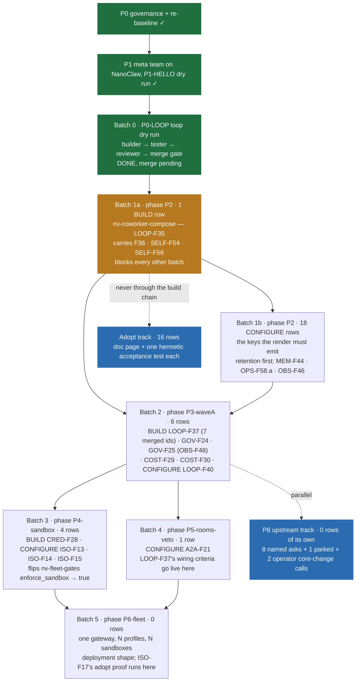

# Hermes port — dispatch plan v3 for the 61 gap-matrix rows (Bot-Mode re-baseline)

Written 2026-09-09. Supersedes `reports/hermes-dispatch-plan-2026-09-08.md`. Same structure, new content: every one of the 61 rows now carries a re-baseline **disposition** (`rows-final.json`), so only `BUILD` and `CONFIGURE` rows are dispatched to the build chain. Copies: Mac `~/brev/nanoclaw/reports/hermes-dispatch-plan-v3.md`, box `~/haaggarwal/nemoclaw-coworkers/data/shared/hermes/dispatch-plan.md` (= `/workspace/shared/hermes/dispatch-plan.md` inside the Orchestrator's container).

Three different "P" scales are in play; do not mix them:

| Scale | Where | Meaning |
|---|---|---|
| P0 / P1 / P2 | `requirements-v0.3.md` | **priority** of a requirement (P0 = needed to run safely) |
| P0 … P8, P3a–e | `nemoclaw-coworkers-port-plan-v2.html` | **phase** of the port plan (P2 = hermetic testbed + compose plugin) |
| batch 0, 1a, 1b, 2, 3, 4, 5 | this file | **dispatch batches** to the Orchestrator, one per phase in the `phase` field of `rows-final.json` |

Batch order is now the row's own `phase` field: **P2 → P3-waveA → P4-sandbox → P5-rooms-veto → P6-fleet → P8-upstream**. That order still satisfies the port plan's dependency line ("P4 blocks P6/P7 · P3a blocks P4/P5 · P2 blocks all plugin exits"), because P2 is where the compose plugin renders the config every later phase reads.

## The baseline every batch obeys

Authoritative text: `container/spines/hermes/context/topology.md` (nv-hermes worktree), decided by the operator 2026-09-08. A row whose ADR needs something else says so in a CORE-CHANGE section and gets the operator's decision first.

1. **One gateway per fleet, Bot Mode.** Coworkers are profiles of that gateway. A second gateway only at a tenant boundary. **Never one gateway per bot.**
2. **Bot-to-bot is Bot Chat inside the gateway** (`message_agent`, rooms, @mentions); durable hand-offs are **kanban**. **a2a is cross-gateway peering only** — never inside the fleet.
3. **Per-profile podman tool sandboxes, a MUST.** Every file / shell / code-exec / MCP-client call runs in the profile's sandbox; no `local` environment anywhere; a `pre_tool_call` veto enforces it. The gateway process stays shared.
4. **Elevated orchestrator profile.** Only it carries the fleet-admin toolset; the same veto denies admin tools to everyone else. This is the fleet's `cli_scope` — one small plugin plus per-profile config, **not a guard catalog**.
5. **Adopt Hermes-native first.** Build a plugin only for what O1–O8 need and Hermes lacks.
6. **Unified panel.** One desktop app on the one gateway for sessions, bots, rooms, cron, approvals, cost.

## Order



Rules that make the order executable:

1. **Batch 0 is history.** The `plugin/hello` loop dry run (row id `P0-LOOP`, criteria `AC-P0-LOOP-1` pytest, `-2` ui, `-3` live) has run builder → tester → reviewer → Orchestrator merge gate; it is **DONE pending merge**. Nothing else waits on it. Do not re-dispatch it.
2. **Only `BUILD` and `CONFIGURE` rows are dispatched.** 30 of the 61. `ADOPT` (16) is a doc page plus one hermetic acceptance test, run on the adopt track, never through architect → builder → tester → reviewer. `MERGE→` (11) is never dispatched at all: the id becomes a named criterion `AC-<id>` in the target row's ADR and the target's PR cannot merge without it. `DEFER` (4) is recorded with its reason and not dispatched.
3. **Batch 1a blocks everything.** Every other batch's deliverable is either config the compose plugin renders or a plugin whose settings that render emits. 1b and 2 may *start* when 1a's first PR has a tester PASS at its head; neither may *merge* before 1a merges.
4. **In flight: 3 rows at once.** Each row is up to four containers (architect, builder, tester, reviewer) at 3 GB each on the CPU box.
5. **Escalations.** A tester FAIL loops back to the builder (max 2 rounds); a reviewer REQUEST_CHANGES likewise (max 2). After the caps the Orchestrator posts one line to the human and stops that row; the ledger cell reads `blocked: P<n> — …`. Nobody re-dispatches a capped row silently.
6. **Cost.** Cap and ceiling $150 per coworker session; hitting the ceiling stops the session and posts a decision card in the Orchestrator chat (Decision 3). Budget guide $150–400 per row.
7. **Merge target** is always `release/v2026.8.31-e2e-fixed` on `slang-coworkers/hermes-agent`, squash, through the Orchestrator's merge gate (P1–P6 green). Never the fork's `main`, never upstream.
8. **Baseline conformance is a merge-gate check, not advice.** A row's ADR is rejected if it introduces a per-bot gateway, uses a2a inside the fleet, reintroduces a guard catalog, or gives the plugin a runtime of its own. `BUILD` notes must name the Hermes surface (hook / tool / command / middleware / secret source); `ADOPT` and `CONFIGURE` claims must cite the Hermes file (path + function or config key) that provides the feature, in the `tag:` / `main:` form the evidence file uses.
9. **Exactly one plugin registers `pre_tool_call`** — `nv-fleet-gates`. A conformance test on a rendered fleet asserts it. Blocks are evaluated before approves inside its ordered predicate chain, so no later predicate can pre-empt a block.
10. **Fail-closed is each plugin's own obligation.** Core swallows a raising `pre_tool_call` callback and lets the call proceed (only a *hang* becomes a block). Every veto body is wrapped in `try/except BaseException` returning `action: block`. A row whose test does not prove this does not pass review.

## Batch 0 — the loop dry run (history, DONE pending merge)

| Row | What it proved | State |
|---|---|---|
| `P0-LOOP` (not one of the 61) | `plugin/hello` travelled builder → fork draft PR → tester `[Test Report]` → reviewer verdict → Orchestrator merge gate, with all three criterion kinds exercised (`pytest:` / `ui:` / `live:`) | **DONE**, merge pending |

## Batch 1a — phase P2 — the compose plugin (`nv-coworker-compose`)

Requirement FR-11. One dispatched row; three ids ride it as criteria.

| Row | Name | Disp | Deliverable | AC kind |
|---|---|---|---|---|
| **LOOP-F35** | Lego coworker composition (spines, types, traits) | BUILD | ONE plugin, `kind: standalone`: three CLI verbs (`hermes coworker compose`, `hermes onboard project`, `hermes onboard coworker`), the two onboarding verbs also as `/onboard-*` and as **orchestrator-only** gateway tools via `ctx.register_tool(check_fn=…)`. Resolves the `coworker-types.yaml` extends chain and **renders** a full profile distribution per type (`distribution.yaml`, `SOUL.md`, `config.yaml`, `skills/`, `cron/`, `mcp.json`, `.env.EXAMPLE`), writes `ui_meta['hermes-bots']` per-key CAS, creates each Bot Chat + the standing rooms via `groups.create`/`groups.state`. **The rendered `config.yaml` is the single source of every invariant key batch 1b depends on** — a missing key is a render bug caught by a golden test, never a silent default. No gateway of its own, no a2a, no guard catalog, no per-bot process. | pytest |

Carried by **LOOP-F35** (each is a named criterion in its ADR; the PR cannot merge without them):

- **carries AC-LOOP-F36** — workflows and overlays: each workflow body renders to `skills/<workflow>/SKILL.md`, each type gets a `skill-bundles/<type>.yaml` alias whose `instruction:` prepend is the anchored entry, overlays spliced by `applies-to` (golden diff proves the selection).
- **carries AC-SELF-F54** — self-mod tier 1 / agent-spawned agents: the orchestrator's `onboard_coworker` creates a profile that appears in the Bots list; the identical call from a worker profile is **refused by the veto and absent from that profile's schema**.
- **carries AC-SELF-F56** — project + coworker onboarding: `hermes onboard coworker slang-coworkers.yaml` on the one gateway produces the five profiles in the desktop Bots list with rendered SOUL.md, role descriptions and `ui_meta['hermes-bots']`.

## Batch 1b — phase P2 — the 18 CONFIGURE rows the render must emit

All cheap (rendered config + doc page + hermetic test), all downstream of 1a's renderer. Dispatch in the wave order below: **retention first**, because those keys are what keep every later batch's evidence on disk.

**Wave 1 — retention and capture (do these first or lose the evidence)**

| Row | Name | Deliverable | AC |
|---|---|---|---|
| MEM-F44 | Transcript retention / archiving | `sessions.auto_prune: false` written explicitly into the DEFAULT (multiplexer) profile **and** every coworker profile, plus an explicit `checkpoints.auto_prune`; upstream default flipped to true and the startup sweep deletes the transcript *and* `request_dump_*` files with the row. Highest-value config row for O8. | pytest |
| OPS-F58.a | Ops tooling (migrations, uninstall, doctor) | Adopt the native ops stack (declarative state-DB reconciliation, `hermes config migrate`, rotating redacted logs, `doctor`, `debug share`, `uninstall --dry-run`); carry over only one slang-coworkers on-call runbook page. Fleet image leaves coworker s6 slots at `desired_state != running` so only the default slot starts. | pytest |
| OBS-F46 | Raw request/response capture | `HERMES_DUMP_REQUESTS=true` in the **gateway process** environment (service unit / managed `/etc/hermes/.env`) — a profile `.env` reaches only the secret scope. The render *also* writes the key into each coworker `.env` so kanban workers and cron subprocesses are covered. | pytest |

**Wave 2 — entity model, engagement, ingress**

| Row | Name | Deliverable | AC |
|---|---|---|---|
| RT-F01 | Entity model + privilege | Profiles under one gateway with `gateway.multiplex_profiles: true` + `multiplex_profile_allowlist`; the render owns profile dirs, per-profile config, per-platform allowlists and **every webhook route with its own secret and `profile:` binding in the DEFAULT profile** — no coworker profile ever enables a port-binding platform. Rooms are documented operator bring-up, not rendered. | pytest |
| RT-F02 | Engage modes | Per-platform config on each profile: `require_mention`, `mention_patterns`, `_register_mentioned_thread` (mention-sticky), `free_response_channels`, `allowed_channels`. No routing plugin. | live |
| RT-F03 | Session modes | Per-platform config: `group_sessions_per_user: false` for a shared group session; per-thread continuity is free when the adapter supplies `thread_id`. | live |
| CH-F52 | GitHub webhook receiver / issue routing | O1's ingress = webhook routes rendered into the DEFAULT profile's config, each with its own `secret` and explicit `profile:` binding. | pytest |

**Wave 3 — approvals and MCP scope**

| Row | Name | Deliverable | AC |
|---|---|---|---|
| GOV-F23 | Approvals primitive | `mode: smart`, `timeout: 300`, and **all three** unattended resolvers denied (`cron_mode`, `unattended_mode`, `single_query_mode` — the last is what actually governs kanban workers). Per-role narrow `command_allowlist` checked before detection; `approvals.deny[]` as the never-bypassable floor. Nothing set to `approve`. Only fleet-uniform keys go to managed scope. | live + pytest |
| GOV-F27 | MCP allow-list / server registry | Per profile only the MCP servers its role needs, `tools.include` naming the exact tool set, `trust: untrusted` on third-party servers so write verbs escalate to the approval gate. Per-profile managed scope is a P8 ask. | pytest |

**Wave 4 — memory, learnings, skills distribution**

| Row | Name | Deliverable | AC |
|---|---|---|---|
| MEM-F41 | Per-agent file memory + persona | Identity from the rendered `SOUL.md` (per profile, security-scanned); role-scoped standing instructions from the workspace `AGENTS.md` chain (git-versioned), curated volatile memory stays Hermes-native and per profile. | pytest |
| MEM-F42 | Bounded always-loaded memory | Render the `curator` block per profile: `enabled`, `interval_hours`, `min_idle_hours`, `consolidate` where skill sets overlap, `prune_builtins` per role, `backup.enabled` + `keep` so every pass is rollback-able. | pytest |
| MEM-F43 | Shared learnings / wiki | One git repo is the fleet's learnings store; `skills.external_dirs: [<shared-clone>/skills]` on every profile. Write access is **not** a mount: non-promotion by config plus the `skill_manage` predicate on the veto. | pytest |
| SELF-F55 | Agent templates / plugin MCP | Each coworker type authored once as a profile distribution repo and installed with `hermes profile install`; cron jobs authored `enabled: false` to mirror paused recurring tasks. Ref pinning on `profile install` is this row's single P8 ask. | pytest |
| SELF-F57.b | Hourly external-skill fetch mirrored | `skills.external_dirs: [/data/shared-skills]` in every profile's config — one directory feeds every bot, picked up within the 30 s mtime cache, no gateway restart, no session interruption. No plugin, no hook, no core change. | pytest |

**Wave 5 — cron, timezone, supervision, per-profile runtime**

| Row | Name | Deliverable | AC |
|---|---|---|---|
| SCHED-F33 | Pre-task script gates + backoff | `cron.script_timeout_seconds: 30` (nanoclaw parity), `cron.failure_nudge_threshold: 3` emitted **by value** (no `config_defaults.py` entry to infer from), per-job `script` / `monitor` fields. Residual auto-backoff / auto-pause is a P8 ask for two config keys. | pytest |
| SCHED-F34 | Per-group timezone override | `timezone: <IANA>` per profile; `hermes_time.py` grounds cron parsing, run-log stamps and the system-prompt clock. One line of sandbox `TZ`. | pytest |
| LOOP-F39 | supervise-issues nudger + worktree reaping | Reaping adopted whole (`hermes worktree list|prune`, `/worktree new`, the kanban dispatcher's TTL/heartbeat/crash/`failure_limit` ladder). The nudger becomes a **skill + a 12 h cron job in the orchestrator's distribution** — no plugin, no reaper, no polling loop outside cron. esc=Y drops. | pytest |
| ISO-F16 | Per-group container config / multi-provider | Per-coworker runtime is the profile's own `config.yaml`: model/provider/effort/fallbacks, `mcp_servers` scoped per role, `terminal.*` mounts/image/backend, toolsets — shipped as a distribution and byte-reproducible on install. | pytest |

## Batch 2 — phase P3-waveA — the gates, the ledgers, the cap

| Row | Name | Disp | Deliverable | AC |
|---|---|---|---|---|
| **LOOP-F37** | Critique gate + chain-routing gate | BUILD | `nv-fleet-gates`, `kind: standalone`, registering **exactly one** `pre_tool_call` callback plus CLI verbs; per-profile policy in `plugins.entries.nv-fleet-gates` rendered by 1a, per-session state in `plugin_db`. Ordered predicate chain, **first match wins, blocks before approves**: (1) SANDBOX, (2) FLEET-ADMIN SCOPE, (3) WIRING, (4) GATES. Body wrapped `try/except BaseException` → `block`. Tool names canonicalised through a vendored alias map; the restricted set asserted against the running registry at load. | pytest |
| **GOV-F24** | Approval-decision ledger | BUILD | `nv-approval-ledger`, deliberately separate from `nv-artifact`, sharing the SAME single `pre_gateway_dispatch` webhook observation seam. `approval_decisions` with `UNIQUE(repo, pr, commit_sha)` + `INSERT OR IGNORE`; `provenance` column; `list_trusted_decisions` the only metric read path. Write tools registered `check_fn=…` so they are **absent from every non-reviewer schema**; `writers` setting re-read fail-closed. Human verdicts enter through exactly one door: the `pull_request_review` webhook route, keyed on `X-GitHub-Delivery`, HMAC-validated. | pytest |
| **GOV-F25** | PR→session mappings, first-claim-wins | BUILD | `nv-artifact`, kanban-anchored, one `plugin_db` with two tables: `ownership` (INSERT OR IGNORE, first claimant wins, second claim refused naming the holder) and `outcomes`. Feeds: ONE `post_tool_call` observer watching **`terminal` AND `execute_code`** for a successful `gh pr create` URL, ONE `pre_gateway_dispatch` subscription, plus the kanban observers. The card is the ownership record; later events are delivered through the task's notify+wake subscription, never by minting a session per delivery. Orchestrator-only CLI: `hermes pr remap`, `hermes outcomes funnel\|winrate\|cost-per-merge`. | live + pytest |
| **COST-F29** | Two-tier per-session cost cap | BUILD | `nv-cost-cap`, hooks + middleware only. Authoritative accrual is **Hermes's own** `sessions.estimated_cost_usd` + `session_model_usage` (subagent- and aux-inclusive), reconciled on `post_tool_call` / `on_session_end`; `post_api_request` is a fast path only (core fires it inside `try/except: pass`). Enforcement **never raises** — the `llm_execution` middleware returns a synthetic terminal response; the authoritative stop is the profile-scoped ESTOP sentinel + a `pre_tool_call` block. Two windows as validated in nanoclaw. Deleted, not ported: transcript scan, vendored rate table, `cost-thresholds.json`. | pytest |
| **COST-F30** | Escalation card + exact set-ceiling | BUILD | Same plugin. A crossing raises the decision through **Hermes's own approval gate** (`request_tool_approval(rule_key='cost:<episode>:<budgetGen>')`), so it lands on every surface that already renders approvals including the desktop panel; `/cost continue\|stop\|ceiling <usd>` is the text path, native buttons an enhancement. Resolution is a CAS on `(episodeId, budgetGen)` — a second click *or* a second `/cost continue` grants exactly one increment. Click authz against the plugin's own `operators` setting. Both nanoclaw v2 P0 defects (pill double-grant, unauthenticated click) are the two criteria. | live |
| LOOP-F40 | PR review coworkers, human-invited post-back | CONFIGURE | Two GitHub webhook routes rendered into the **DEFAULT** profile's config, each with its own secret and explicit `profile:` binding: a `pull_request` route (`opened`/`synchronize`, `profile: reviewer`) whose script filter upserts a kanban card, plus the review route. Zero port-binding platform entries in any coworker profile. | pytest |

Carried by **LOOP-F37** (seven ids, each a named criterion in its ADR):

- **carries AC-GOV-F22** — the veto's restricted tool-name set is enumerable and asserted against the running registry at load, so a typo / upstream rename / new shell-capable tool fails the plugin's load instead of failing open. Replaces the guard catalog entirely.
- **carries AC-GOV-F26** — fleet-admin scope: admin-shaped tools (onboard/render, board and room admin, cron for another profile, cost-cap control, ledger writes) denied **by tool name** to any non-orchestrator profile.
- **carries AC-LOOP-F38** — plan gate: `write_file` / `patch` / mutating `terminal` refused until the session has a plan under `.hermes/plans/*.md`, per-profile toggle.
- **carries AC-A2A-F18** — wiring: plugin-owned `edges(from_profile, to_profile, gated)` + `hermes wire add|remove|list`; `message_agent(target=)` / `kanban_create(assignee=)` against an unwired edge is **blocked, not logged**.
- **carries AC-A2A-F19** — a gated edge returns `action: approve` with `rule_key: wire:<from>:<to>`, so Hermes's own gate holds the send in the sender's Bot Chat; deny returns the reason, timeout fails closed. No plugin-owned approval path.
- **carries AC-CH-F51** — destination ACL: room membership plus the wiring predicate; a bot's attempt to reach an unwired peer is **refused, not merely logged** (goes live in batch 4).
- **carries AC-ISO-F10** — sandbox predicate, rendered inert (`enforce_sandbox: false`) until batch 3: resolved backend must be the profile's own container backend, `ensure_task_env()` must have run, stdio `mcp_*` denied, the dangerous-command floor re-asserted, cross-profile gateway-process calls hard-failed while the pin lacks `terminal_scope.py`.

Carried by **GOV-F25**:

- **carries AC-OBS-F48** — fleet metrics: the `outcomes(artifact, terminal_outcome, cost_usd, profile)` table plus `hermes outcomes winrate|funnel|cost-per-merge`, fed by the kanban observers and `on_session_end` with cost rolled up from `session_model_usage` and attributed through the ownership row. **Not** published over Hermes's OTLP exporter (closed event set + attribute allow-list); a drop-in dashboard extension page reads the same ledger.

## Batch 3 — phase P4-sandbox (needs the podman-capable box)

Merging this batch is what flips `nv-fleet-gates` `enforce_sandbox` from `false` to `true` and makes `AC-ISO-F10` live.

| Row | Name | Disp | Deliverable | AC |
|---|---|---|---|---|
| **CRED-F28** | OneCLI credential gateway | BUILD | `podman-onecli`, **credential half only — no `TerminalEnvironmentProvider` subclass ships**. Every profile runs the built-in docker backend with `HERMES_DOCKER_BINARY` → the podman wrapper, so the fleet keeps the fail-closed egress spawn, read-only CA mount, collision guards and orphan reaper for free. Registers an `onecli` SecretSource resolving **only proxy coordinates** (base URL, CA path, agent token — never a provider credential, the source is startup-time and refresh-free); calls `ensureAgent(name=identifier=<profile>)` from `on_session_start`; supplies `strip_env_keys`. Exactly one egress topology per profile, asserted in the render test. | live + pytest |
| ISO-F13 | Mount composition / allowlist | CONFIGURE | Mounts are **rendered, not policed**. Each coworker's workspace root lives OUTSIDE `$HERMES_HOME`; `terminal.docker_volumes` is an explicit set — that workspace rw, shared install surfaces ro, nothing else, and **no path under `$HERMES_HOME` or any profile dir** (symlinks resolved in the test). This is also what makes per-role config immutable to the agent. | pytest |
| ISO-F14 | Egress lockdown | CONFIGURE | Built-in docker backend + podman wrapper + the egress hop with `enforce_on_docker: true`, so every sandbox receives the CA read-only, the proxy environment and `HERMES_PROXY_TOKEN_*` swap tokens instead of credentials. | live |
| ISO-F15 | Session driver seam | CONFIGURE | `terminal.backend: docker` + podman wrapper on every profile; `local` **banned** by rendering the key everywhere and asserting it. Kanban workers and cron jobs are separate processes and *do* resolve their own profile's backend, so per-profile sandboxes are configuration for **all durable work**. Gateway-process turns do not, at the pin — recorded as a CORE-CHANGE: (a) tool-bearing work runs on the board, not Bot Chat, until the pin moves; (b) moving the pin to a tree with `tools/terminal_scope.py` is the prerequisite; (c) `TERMINAL_ENV=docker` in the unit is **not** a substitute (process-global → one shared container identity). NanoClaw's driver seam and vm tier are retired. | pytest |

## Batch 4 — phase P5-rooms-veto

| Row | Name | Disp | Deliverable | AC |
|---|---|---|---|---|
| A2A-F21 | Runaway protection | CONFIGURE | Per profile `tool_loop_guardrails.hard_stop_enabled: true`, warn/hard-stop counters and `kanban.failure_limit`; **also** pinned in managed scope because the block is fleet-uniform, so a self-modifying bot cannot widen it. `A2A_MAX_PINGPONG_TURNS` is deliberately **not** rendered (peering guardrails land with CH-F53 if ever revived). Doc page states where each nanoclaw behaviour landed: echo-drop → room round caps + identical-call breaker; bounced-a2a redrive → cross-gateway only, deferred; runaway card → COST-F30's ceiling decision. No plugin. | live + pytest |

Also going live in this batch (no new dispatch): **AC-A2A-F18 / AC-A2A-F19 / AC-CH-F51** on LOOP-F37, once rooms and the `edges` table are provisioned.

## Batch 5 — phase P6-fleet

**Zero BUILD/CONFIGURE rows.** P6 is the deployment shape, not a matrix row: one gateway container, N profiles, N podman sandboxes, `gateway.multiplex_profiles: true` + `multiplex_profile_allowlist`, supervised by systemd `Type=notify` + WatchdogSec (launchd KeepAlive on macOS) plus `shutdown_watchdog.py`. `hermes gateway install` lands here (OPS-F58.a's deferred half). The adopt-track proof for **ISO-F17** runs against this boot.

## P8 — upstream track (parallel from batch 2, 0 rows of its own)

Down from "17 esc=Y rows" to eight named asks, one parked, and two operator core-change calls:

| Ask | Owner row |
|---|---|
| Turn-end hold that fires when a turn edited no files (`pre_verify` is gated on `_turn_file_mutation_paths`) | LOOP-F37 |
| Fire `post_api_request` / run `llm_execution` middleware on the codex app-server path | COST-F29 |
| Date-effective pricing + a fleet-wide aggregate endpoint | COST-F31 |
| Persist a parked clarify entry and re-arm on start (today it lives in memory; a restart loses it) | CH-F50 |
| Ref pinning on `hermes profile install` | SELF-F55 (SELF-F57 carries it) |
| `cron` auto-backoff + auto-pause after N consecutive failures (two config keys) | SCHED-F33 |
| Make transcript-file deletion opt-in separately from row pruning | MEM-F44 |
| Per-profile managed scope | GOV-F27 |
| **Parked** (needs CH-F53 revived): `in_reply_to` on a2a | CH-F53 |
| **Operator core-change call**, not an upstream ask: move the pin to a tree containing `tools/terminal_scope.py` | ISO-F15 |
| **Operator core-change call**: a custom provider plugin, only if the podman wrapper cannot express slirp/vfs/no-pivot | CRED-F28 |

Withdrawn by the re-baseline: `authorize_source` (RT-F09 — authorization stays with pairing/allowlists and the orchestrator toolset), `Dict[Platform, PlatformConfig]` (CH-F49 — one bot = one profile needs no instance dimension), ISO-F11's esc=Y (dissolves into configuration + a test), LOOP-F39's esc=Y.

## Adopt: doc page + hermetic acceptance test only

16 rows. Each deliverable is exactly one doc page mapping the NanoClaw behaviour onto the Hermes feature, plus one hermetic acceptance test proving Hermes does it. **No plugin, no dispatch through the build chain.**

`rows-final.json` records `phase: n/a(adopt)` for all sixteen; the grouping below is the phase whose run the doc page and test ride along with — derived here for scheduling, not read from the file.

**Attaches to P2**

| Row | Name | What Hermes already provides (cited surface) | AC |
|---|---|---|---|
| OBS-F45 | Dashboard (Pixel Office / Coworkers / Timeline / Admin) | Bot Mode desktop roster + rooms + Routines; machine-level web dashboard with profile switcher (Sessions / Analytics / Cron / Logs / Skills / Profiles / Kanban); dashboard extension SDK. Machine-level = fleet-level once rule 1 holds. The hooks-fed `hook_events` table is **not** part of this row — the only telemetry the outcomes need is `AC-OBS-F48` in `nv-artifact`. | ui |
| OBS-F47 | Transcript viewing | `hermes sessions export --format jsonl\|md\|qmd\|html\|trace` with `--redact` and single-file HTML; `session_search` over FTS5; `/save`; dashboard Sessions page. Native and complete. | pytest |
| CH-F49 | Channel adapter registry / Chat SDK bridge | `kind: platform` plugin subclassing `BasePlatformAdapter`, self-registering via `ctx.register_platform` with **zero core edits**; the base class already supplies the text fallbacks NanoClaw's capability flags negotiated. | pytest |
| CH-F50 | Interactive operations (cards, questions, reactions, files) | `clarify` tool + gateway primitive with per-adapter inline buttons and a numbered-text fallback; approval cards with Allow once/session/always/Deny; document sends and reactions. | live |
| SELF-F57 | Skill engine + zero-downtime refresh | Profile distributions + `hermes profile update` replacing distribution-owned files only (SOUL.md, config.yaml **only** with `--force-config`, mcp.json, skills/, cron/), leaving memories, sessions, auth and `.env` untouched. | pytest |
| SCHED-F32 | Durable scheduled tasks with cron recurrence | `cron/jobs.py` (atomic store, `parse_schedule`, `compute_next_run` re-armed inside the fire lock), `cron/scheduler.py` (60 s tick, cross-process flock, fresh session per run, `_failure_streak_nudge`), `cron/executions.py`. Each profile owns its jobs; `hermes profile install/update` is the git-versioned deployment path `ncl tasks create` used to be. | pytest |
| RT-F05 | Admission / unknown-sender policy | `gateway/pairing.py` (PairingStore, `generate_code`, `approve_code`) + `unauthorized_dm_behavior: pair\|ignore`; `pair` *is* request-approval, and the grant unions into the allowlist. | live |
| RT-F07 | Cold-DM cache / outbound addressing | `resolve_send_target` (`platform:#channel`, `platform:chat_id`, `user:<id>`, `user_name:<handle>` with Slack `conversations.open` per call), the channel-directory cache and the per-platform HomeChannel fallback, used by cron delivery, the kanban notifier and `hermes send`. | live |
| RT-F09 | Pluggable router seams | `VALID_HOOKS`: `pre_gateway_dispatch` (skip/rewrite, first-claim-wins, one fire per inbound event — and **the fleet's only per-webhook-delivery observation point**), `pre_tool_call`, `on_session_start/end/reset`. Doc page also records the withdrawal of the `authorize_source` ask and warns every row wanting lifecycle events about the colon-named non-hooks. | pytest |

**Attaches to P3-waveA**

| Row | Name | What Hermes already provides | AC |
|---|---|---|---|
| COST-F31 | Durable cost ledger + pricing parity | Native per-call accrual for every provider (`record_response_usage`), aux models (`record_aux_usage`), subagents rolled into the parent (`_rollup_children_cost`), codex-native accrual; tokens persisted per (session, model, provider, mode) so a pricing correction is a **reprice, not a re-scan**. The acceptance test pins the invariant COST-F29's enforcement read depends on. | pytest |
| ISO-F11 | Idempotent claim/ack lifecycle with retry | `claim_task` / `heartbeat_claim` / `release_stale_claims` / `detect_crashed_workers` / `check_respawn_guard`, plus `delivery_ledger.py` (pending→attempting→delivered/failed, honest at-least-once recovered marker) and the webhook delivery-id cache + `kanban create --idempotency-key`. | live |
| ISO-F12 | on_wake / race-free restart / kill switch | `agent/estop.py` profile-aware `ESTOP` sentinel (`hermes -p <bot> pause`/`resume`, in-band `/pause`) gating new turns, cron fires and kanban spawns; `restart.py`'s drain-and-restart. Also the mechanism COST-F29's authoritative stop uses. | live |
| OPS-F58 | ncl admin CLI | The 73-verb builtin subcommand surface: `hermes profile` = agent groups, `hermes cron` = tasks, `hermes sessions`, `hermes kanban`, plus plugins/skills/config/gateway/webhook/secrets/egress/monitoring/insights/pairing. **Build nothing called ncl.** The scope half is `AC-GOV-F26` on LOOP-F37, which is why the proof rides P3. | live |

**Attaches to P5-rooms-veto**

| Row | Name | What Hermes already provides | AC |
|---|---|---|---|
| A2A-F20 | Reply-home lineage | Three native correlations replace the nanoclaw triple: Bot Chat reply-home (`message_agent` → `terminal_tool(background, notify_on_complete)` → completion injected into the calling session), the kanban task + its notify subscription for durable hand-offs, and a2a `task/contextId` for cross-gateway peering only. | live |
| RT-F08 | Cross-session context | The room plus the board, not an echo: members see each other's turns through the shared room transcript while keeping their own `Group: <name>` session; durable hand-off text lives on the card; anything older is pulled with `session_search`. | live |

**Attaches to P6-fleet**

| Row | Name | What Hermes already provides | AC |
|---|---|---|---|
| ISO-F17 | Host sweep / restart recovery | The supervision stack around ONE gateway: systemd `Restart=always` + `Type=notify` + WatchdogSec (launchd KeepAlive), `shutdown_watchdog.py` (event-loop heartbeat, stack dump, 3-strike loop watchdog), `restart.py` exit-75 drain-and-restart; `container_boot.py` reconciles per-profile s6 slots so only the default slot starts. | live |

## Defer: recorded with the reason, not dispatched

| Row | Name | Reason |
|---|---|---|
| CH-F53 | Cross-instance routing (canonical router + peer forwarding) | One gateway per fleet means there is no second instance to route to — no `owner_instance` column, no re-signing raw webhook bodies with a plugin-owned secret, no `X-Webhook-Trust` header. Because this row is deferred, **no other row ships peering config**, and the `in_reply_to`-on-a2a ask parks here. Revisit only at a tenant boundary. |
| SELF-F57.a | Deterministic journaled idempotent `nc:` skill engine | The property the engine bought — "setup and the agent install identically, deterministically, once" — comes free from `hermes plugins install <repo> --ref <sha>` and `hermes profile install`: one path for both callers, manifest-declared env/deps/load order. |
| RT-F04 | Adapter-declared ChannelDefaults | No O1–O8 criterion depends on adapters declaring wiring-time defaults. With a handful of platforms the compose plugin writes the same few keys straight into each profile's config, and `register_platform` refuses extra declaration fields anyway. |
| RT-F06 | Dropped-messages ledger | Nothing in O1–O8 reads a per-sender drop ledger. Unauthorized/skipped inbound is logged by the gateway and pending pairing requests are enumerable from `hermes pairing` and the dashboard — enough for a fleet whose channels are operator-controlled. |

## Coverage check

30 dispatched (batch 1a **1** + 1b **18** + 2 **6** + 3 **4** + 4 **1** + 5 **0**) + 16 adopt + 11 merge + 4 defer = **61**. Every one of the 61 ids appears exactly once across batches / adopt / defer / merge. Batch 0's `P0-LOOP` is not one of the 61.

By disposition: BUILD 7 · CONFIGURE 23 · ADOPT 16 · MERGE 11 · DEFER 4 = 61.
By phase (dispatched only): P2 19 · P3-waveA 6 · P4-sandbox 4 · P5-rooms-veto 1 · P6-fleet 0 · P8-upstream 0 = 30.

## What changed vs the 2026-09-08 plan

**Counts.** Dispatched rows drop **61 → 30**. Plugins to be written drop **11 → 6** (`nv-coworker-compose`, `nv-fleet-gates`, `nv-approval-ledger`, `nv-artifact`, `nv-cost-cap`, `podman-onecli`). Upstream asks drop **17 esc=Y rows → 8 named asks + 1 parked + 2 operator core-change calls**.

**Plugins that dissolve.** `nv-policy-core`, `nv-critique-gates`, `nv-a2a-wiring` and the veto half of `nv-sandbox` collapse into the **single** `nv-fleet-gates` `pre_tool_call` callback (rule 9). `nv-routing` disappears entirely — RT-F01/02/03 are per-platform profile config and RT-F05/07/08/09 are adopts. `nv-memory-okf` disappears — MEM-F41…F44 are rendered config keys. `nv-telemetry` disappears — OBS-F45/F47 adopt the native panel and exporters, OBS-F46 is one process-level env var, and OBS-F48 survives as a table inside `nv-artifact`. `nv-sandbox` keeps only its credential half as `podman-onecli`; **no `TerminalEnvironmentProvider` subclass ships**. `nv-fleet` becomes the deployment shape, not code.

**Notable moves.**

- **Old batch 1b (8 rows) → 2 dispatched rows in batch 2.** GOV-F22, GOV-F26 and LOOP-F38 fold into LOOP-F37; OBS-F48 folds into GOV-F25; OBS-F45 becomes ADOPT; OBS-F46 drops to a P2 config row. Only LOOP-F37 and GOV-F24 survive as dispatches, and they move from 1b to batch 2 because their phase is P3-waveA.
- **Old batch 2 (41 rows) dissolves.** Its config-shaped rows move **up** into batch 1b (they are the compose render's own output, and MEM-F44 / OPS-F58.a / OBS-F46 must land before any later batch's evidence survives on disk); its build rows (COST-F29/F30, GOV-F25) move to batch 2; 10 of its rows become ADOPT; CH-F53, RT-F04, RT-F06 become DEFER.
- **CRED-F28 moves down, old batch 2 → batch 3.** It is the credential half of the sandbox and belongs with P4.
- **Old batch 3 (P4: ISO-F10, F13, F14, F11, F17) → CRED-F28 + ISO-F13/F14/F15.** ISO-F10 becomes a criterion on LOOP-F37, rendered inert until this batch flips `enforce_sandbox`; ISO-F11 and ISO-F17 become ADOPT (ISO-F17's proof rides P6); ISO-F15 moves in from old batch 2.
- **Old batch 4 (A2A-F18…F21) → one dispatched row.** F18 and F19 become the wiring predicate and the gated-edge `action: approve` on LOOP-F37; F20 becomes ADOPT; only A2A-F21 stays, and as CONFIGURE, not BUILD.
- **Old batch 5 keeps its shape but loses its rows.** P6 has zero matrix rows; P7 (OpenShell/NemoClaw + APF) is unchanged and out of this file's scope.
- **A new hard invariant that was not in the 2026-09-08 plan:** rules 9 and 10 — exactly one `pre_tool_call` registrant, and fail-closed as each plugin's own obligation because core swallows a raising callback. Both were discovered during the re-baseline and both are merge-gate checks.
- **The guard catalog is gone.** GOV-F22 no longer asks for one; the equivalent safety property is "the veto's restricted tool-name set is asserted against the running registry at plugin load", so a rename fails the load instead of failing open.

## How a batch is dispatched

One message per row to the Orchestrator through the dashboard's loopback chat API on the box, `thread_id = hermes-<ROW-ID>` (script: `dispatch-batch1.sh <ids…>`):

```
POST http://127.0.0.1:3937/api/chat/send
{"group":"orchestrator","thread_id":"hermes-LOOP-F35",
 "content":"Dispatch LOOP-F35 — <name>. Row: /workspace/shared/hermes/rows-final.json (disposition, design_note, acceptance_hint); evidence: gap-matrix-evidence.md; baseline: topology.md; plan: dispatch-plan.md. The ADR must cover this row AND every id listed as 'carries AC-<id>'. Add the row to /workspace/agent/reports/ledger.md, dispatch to hermes-architect on thread hermes-LOOP-F35, merge only through the merge gate. Reply here only with the outcome line when merged or blocked."}
```

The Orchestrator adds the ledger row, dispatches to `hermes-architect` (ADR + acceptance test via `hermes-spec-requirement`), the chain runs builder → tester → reviewer, and the Orchestrator merges through the gate. **Adopt-track rows go on a separate, cheaper thread** (`hermes-adopt-<phase>`): doc page + hermetic test, one reviewer pass, no architect ADR.

## Decisions (answer once; defaults in bold are what runs if unanswered)

1. Batch 0 is done pending merge. **Merge `plugin/hello` now and start batch 1a** — or hold the merge and start 1a anyway (the two are independent).
2. Rows with an upstream ask: **plugin-only, and the ADR's CORE-CHANGE section becomes an upstream ask the Orchestrator files** (fork patches outside `plugins/**` only when the ADR proves the plugin surface cannot do it, one commit each, pinned by ref) — or plugin-only with the gap recorded and no fork patch.
3. Ceiling cards ($150/session): **the human approves each card during batch 1a–1b**, revisit after three rows — or raise builder/tester ceiling to $300 now.
4. Tester model: currently `aws/anthropic/bedrock-claude-opus-4-8[1m]`. **Keep opus-4.8 through batch 1a**, switch to a sonnet-class id once the loop is proven.
5. Concurrency: **3 rows in flight.**
6. **Batch 1b's 18 CONFIGURE rows dispatch as five waves in the order written** (retention first) — or flatten to one pool of 18 at concurrency 3.
7. **ISO-F15's CORE-CHANGE (a): tool-bearing work runs on the kanban board, not in Bot Chat, until the pin moves to a tree with `tools/terminal_scope.py`.** Accept, or spend the pin move before batch 3.
8. `rows-final.json` is the row's source of truth from now on (disposition + design_note + acceptance_hint); `gap-matrix.md` stays as the historical inventory. **Accepted as written.**
9. Token rotation for the pasted szihs / API keys: pending on the human's side; not a dispatch blocker.

## Where progress shows

- `groups/orchestrator/reports/ledger.md` — the work list, one row per dispatched id (`merged/blocked` is the outcome). 30 rows now, not 61; the 31 non-dispatched ids appear as `adopt` / `merged-into:<id>` / `deferred` lines so the coverage check stays checkable from the ledger alone.
- `https://nv-hermes-transcript-xrnpj0b3n.gobrev.dev/status/latest.html` — daily status card (08:30 IST)
- `https://nv-hermes-transcript-xrnpj0b3n.gobrev.dev/explanations/` — the HTML explanation of every PR the builder opens
- `/trace/` and `/transcripts/` on the same host for the raw sessions; `gh pr list --repo slang-coworkers/hermes-agent --state all` for the fork

## Verification evidence so far (what is and is not proven)

Proven: the tester runs the desktop e2e suite under xvfb in its own container and produces gated `[Test Report]`s — session `sess-1788442508328-24zim9` (thread `hermes-e2e-baseline`, msg #9 = `[Test Report] … round 4 — head 5c1f623c`, round 5 accepted at #16), session `sess-1788426489551-bi4hkp` (thread `hermes-tester-desktop-preflight`, rounds 1–3); reports `groups/hermes-tester/reports/desktop-preflight/test-report-preflight{,-r4,-r5}.md` + `artifacts-r5/`. Reviewer verdicts exist for P1-HELLO (`sess-1788367756813-sof6y5`, APPROVE r1/r2). Batch 0 closed the builder → tester → reviewer → merge-gate hand-off on a real fork PR.

Not yet proven: any row's acceptance test running against a *rendered fleet* (no fleet is rendered until 1a merges); the `enforce_sandbox` flip; the one-`pre_tool_call`-registrant conformance test.
